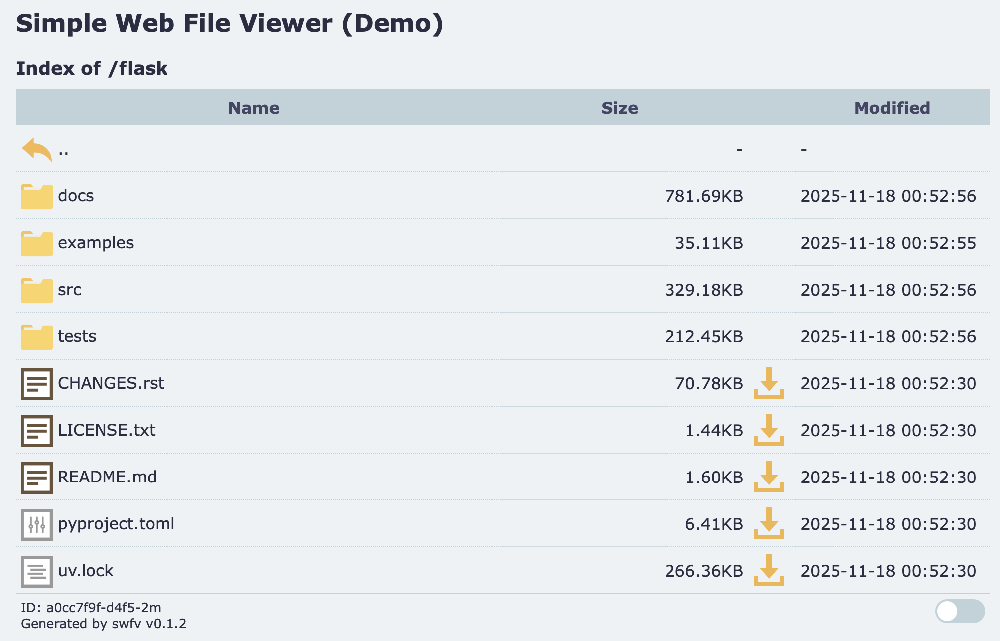
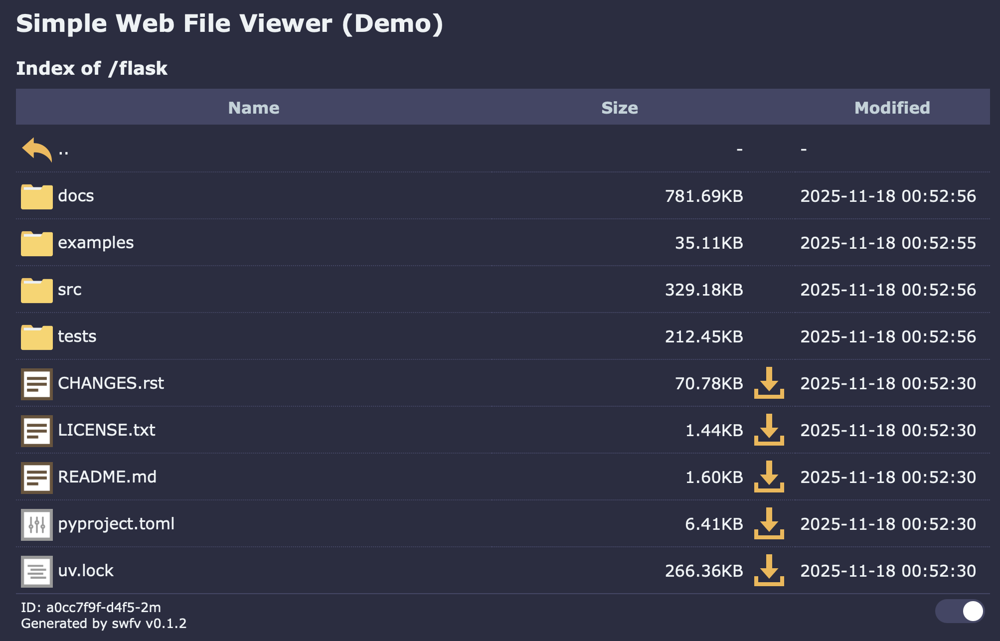

# Simple Web File Viewer

A static-site generator that builds HTML pages with a file index,
enabling users to navigate directories, preview files in the browser, and download them via HTTP.

[](https://github.com/revgen/swfv/actions/workflows/test-repo.yml)
[](https://github.com/revgen/swfv/actions/workflows/build-pages.yml)
[](https://revgen.github.io/swfv/)

You can see [DEMO](https://revgen.github.io/swfv/) site with the result content.

[](https://revgen.github.io/swfv/)
[](https://revgen.github.io/swfv/)

## Install

```bash
pip install git+https://github.com/revgen/swfv.git
```

## Usage

```bash
cli.py [-h] [--output OUTPUT] [--debug] [--name NAME]
              [--display-name DISPLAY_NAME] [--quiet] [--force] [--cleanup]
              [--serve] [--version] [--theme THEME] [--flag FLAG]
              [source]

positional arguments:
  source                Path to the directory that serves as the input for
                        indexing and page generation (default: current)

options:
  -h, --help            show this help message and exit
  --output OUTPUT, -o OUTPUT
                        Path to the directory used as the destination for all
                        generated site content. (default: <source>)
  --debug, -D           Show more verbose log output
  --name NAME, -n NAME  Specifies the short name assigned to the generated
                        static site (default: swfv)
  --display-name DISPLAY_NAME, -d DISPLAY_NAME
                        Specifies the dysplay name assigned to the generated
                        static site (default: swfv)
  --quiet, -Q           Do not show a confirmation prompt
  --force, -F           Force overwrite of index.html files in the destination
                        directory
  --cleanup, -C         Cleanup in the desctination directory, remove all
                        generated files
  --serve, -S           Starts a basic HTTP server that serves files from the
                        destination directory.
  --version, -v         Displays the current version of the tool
  --theme THEME, -T THEME
                        Specifies the directory containing a custom theme
                        (default: embedded theme)
  --flag FLAG, -f FLAG  Extra options to fine-tune the output of the generated
                        pages: hide-generated-by,hide-title,show-hidden

```
